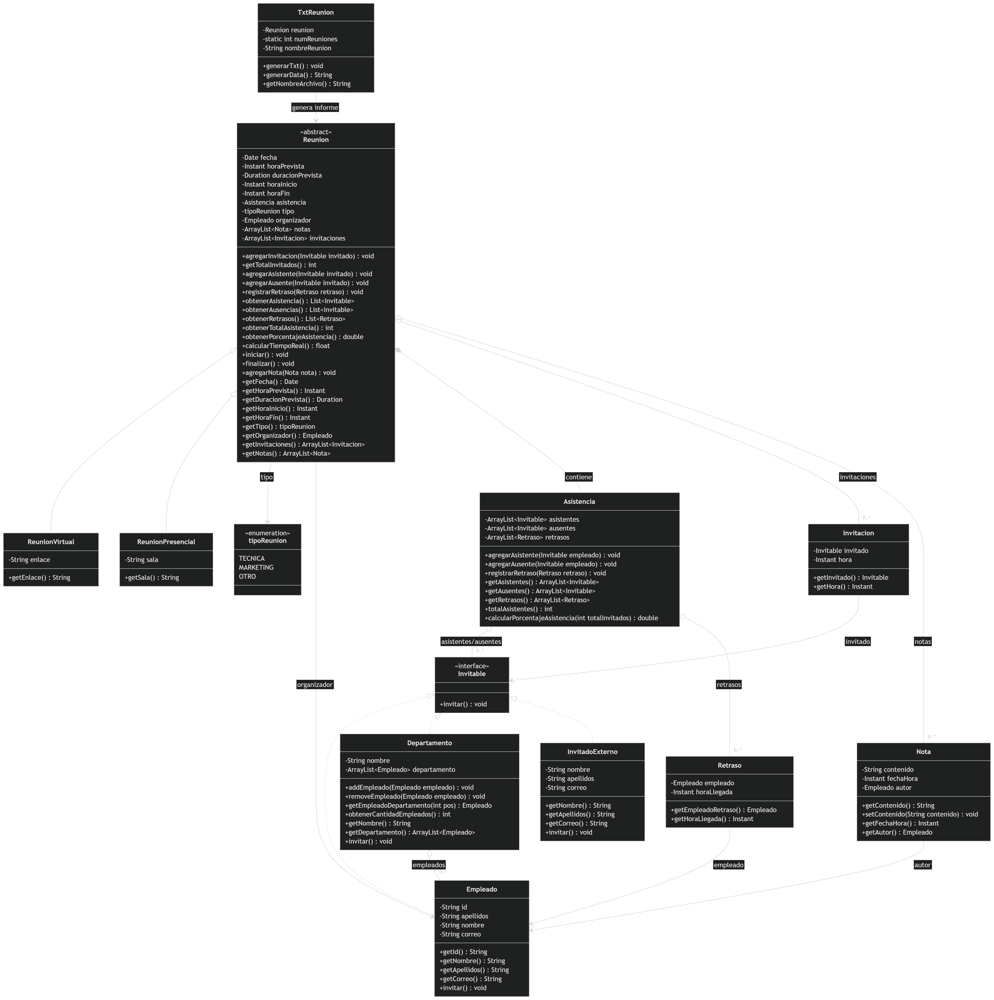

# Tarea 2: Sistema de Gestión de Reuniones - Desarrollo Orientado a Objetos

## Integrantes - Grupo 10

- Agustín Andrés Baeza Mansilla
- Alan Ignacio Flores Yerey
- Ignacio Esteban Placencia Palma

---

## Descripción del Proyecto

Este proyecto corresponde a la Tarea 2 de la asignatura Desarrollo Orientado a Objetos. Consiste en la implementación en Java de un sistema para gestionar reuniones dentro de una empresa, aplicando los principios de la Programación Orientada a Objetos.

El sistema permite crear reuniones virtuales o presenciales, registrar invitaciones, controlar la asistencia de empleados e invitados externos, registrar ausentes, registrar retrasos, agregar notas, iniciar y finalizar reuniones, calcular la duración real de una reunión y generar un informe en formato `.txt`.

El objetivo principal del proyecto es aplicar conceptos de orientación a objetos como clases abstractas, herencia, interfaces, composición, asociación, encapsulamiento, uso de colecciones dinámicas, manejo de fechas y horas, documentación Javadoc y excepciones personalizadas.

---

## UML del Proyecto

El siguiente diagrama representa el modelo UML actualizado del sistema. Se muestra una versión legible del modelo, incluyendo las clases principales, atributos relevantes, métodos principales, getters y setters más importantes, además de las relaciones de herencia, composición, asociación e implementación de interfaces.



El UML fue actualizado a partir del modelo base entregado en la tarea, incorporando las nuevas funcionalidades solicitadas: generación de informe en archivo `.txt`, invitación y asistencia de invitados externos, manejo de asistencia, retrasos, notas y excepciones personalizadas.

Para mantener la legibilidad del diagrama, las excepciones personalizadas no se muestran como clases separadas dentro de la imagen principal, pero sí forman parte del código implementado y se explican en una sección específica de este README.

---

## Clase `Reunion`

`Reunion` es una clase abstracta que representa una reunión general dentro del sistema.

### Atributos principales

- `fecha`
- `horaPrevista`
- `duracionPrevista`
- `horaInicio`
- `horaFin`
- `asistencia`
- `tipo`
- `organizador`
- `notas`
- `invitaciones`

### Responsabilidades principales

- Agregar invitaciones.
- Registrar asistentes.
- Registrar ausentes.
- Registrar retrasos.
- Agregar notas.
- Iniciar una reunión.
- Finalizar una reunión.
- Calcular duración real.
- Obtener total de asistentes.
- Calcular porcentaje de asistencia.
- Entregar información necesaria para la generación del informe.

Esta clase funciona como base común para los distintos tipos de reuniones, permitiendo reutilizar comportamiento y atributos compartidos.

---

## Clases `ReunionVirtual` y `ReunionPresencial`

El sistema permite representar dos tipos específicos de reuniones mediante herencia.

### `ReunionVirtual`

`ReunionVirtual` hereda de `Reunion` y representa una reunión realizada en modalidad virtual.

Atributo propio:

- `enlace`

Este atributo permite almacenar el link de acceso a la reunión.

### `ReunionPresencial`

`ReunionPresencial` hereda de `Reunion` y representa una reunión realizada en modalidad presencial.

Atributo propio:

- `sala`

Este atributo permite almacenar el lugar físico donde se realizará la reunión.

### Justificación de diseño

Se utilizó herencia porque las reuniones virtuales y presenciales comparten la misma estructura general: fecha, hora, duración, organizador, invitaciones, asistencia, notas, inicio y fin. Sin embargo, cada una posee un dato propio: la reunión virtual tiene un enlace y la presencial tiene una sala.

---

## Clase `Empleado`

La clase `Empleado` representa a un trabajador de la empresa.

### Atributos principales

- `id`
- `apellidos`
- `nombre`
- `correo`

### Responsabilidades principales

- Almacenar los datos identificatorios del empleado.
- Permitir que el empleado pueda ser invitado a una reunión.
- Implementar el método `invitar()` definido por la interfaz `Invitable`.

`Empleado` implementa la interfaz `Invitable`, por lo que puede ser utilizado directamente en las invitaciones y en el registro de asistencia.

---

## Clase `Departamento`

La clase `Departamento` representa un área o grupo de empleados dentro de la empresa.

### Atributos principales

- `nombre`
- `departamento`, correspondiente a una lista de empleados.

### Responsabilidades principales

- Agregar empleados.
- Eliminar empleados.
- Obtener empleados por posición.
- Obtener la cantidad de empleados del departamento.
- Invitar a todos los empleados pertenecientes al departamento.

`Departamento` implementa la interfaz `Invitable`, lo que permite invitar a un departamento completo a una reunión. Al invitar un departamento, el sistema recorre su lista de empleados y ejecuta la invitación para cada uno de ellos.

---

## Clase `InvitadoExterno`

La clase `InvitadoExterno` representa a una persona que no pertenece a la empresa, pero que puede ser invitada y participar en una reunión.

### Atributos principales

- `nombre`
- `apellidos`
- `correo`

### Responsabilidades principales

- Almacenar los datos principales de una persona externa.
- Validar que sus datos no sean nulos ni vacíos.
- Permitir que el invitado externo pueda ser invitado a una reunión.

Esta clase fue incorporada porque uno de los requerimientos de la tarea era permitir la invitación y asistencia de personas externas a la empresa, manteniendo su nombre completo y correo electrónico.

---

## Interfaz `Invitable`

La interfaz `Invitable` representa a cualquier entidad que puede ser invitada a una reunión.

### Método principal

- `invitar()`

### Clases que implementan esta interfaz

- `Empleado`
- `Departamento`
- `InvitadoExterno`

### Justificación de diseño

La interfaz `Invitable` permite manejar de forma uniforme distintos tipos de invitados. Gracias a esta decisión, el sistema puede trabajar con empleados individuales, departamentos completos e invitados externos sin duplicar lógica.

Por ejemplo, una reunión puede recibir objetos de tipo `Invitable` sin necesitar saber si corresponden a un empleado, un departamento o un invitado externo.

---

## Clase `Invitacion`

La clase `Invitacion` representa el registro de una invitación realizada a una entidad invitable.

### Atributos principales

- `invitado`
- `hora`

### Responsabilidades principales

- Guardar la entidad invitada.
- Registrar automáticamente la hora en que se genera la invitación.
- Ejecutar el método `invitar()` de la entidad invitada.

Esta clase se relaciona con `Invitable`, ya que una invitación puede estar dirigida a cualquier objeto que implemente dicha interfaz.

---

## Clase `Asistencia`

La clase `Asistencia` se encarga de administrar la asistencia de una reunión.

### Atributos principales

- `asistentes`
- `ausentes`
- `retrasos`

### Responsabilidades principales

- Registrar asistentes.
- Registrar ausentes.
- Registrar retrasos.
- Obtener listas de asistentes, ausentes y retrasos.
- Calcular el total de asistentes.
- Calcular el porcentaje de asistencia.

### Justificación de diseño

La clase `Asistencia` separa la lógica de asistencia de la clase `Reunion`, evitando que `Reunion` concentre demasiadas responsabilidades.

Además, las listas de asistentes y ausentes trabajan con objetos de tipo `Invitable`, lo que permite registrar tanto empleados como invitados externos. Los retrasos se administran mediante una lista de objetos `Retraso`.

---

## Clase `Retraso`

La clase `Retraso` representa la llegada tardía de un empleado a una reunión.

### Atributos principales

- `empleado`
- `horaLlegada`

### Responsabilidades principales

- Asociar un empleado con su hora de llegada.
- Validar que el empleado y la hora de llegada no sean nulos.
- Entregar información para el informe de reunión.

Esta clase se asocia con `Empleado`, ya que cada retraso corresponde a un empleado específico.

---

## Clase `Nota`

La clase `Nota` representa un comentario o registro escrito durante una reunión.

### Atributos principales

- `contenido`
- `fechaHora`
- `autor`

### Responsabilidades principales

- Guardar el contenido de la nota.
- Registrar automáticamente la fecha y hora en que se crea.
- Asociar la nota con un autor.
- Validar que el contenido no sea vacío y que el autor sea válido.

Cada nota se asocia con un `Empleado`, quien cumple el rol de autor de la nota.

### Justificación de diseño

Se mantiene únicamente setter setContenido() pues se justifica que posterior a una reunión se necesite de corregir alguna nota hecha con algún tipo de error de tipografía, por otro lado, se descartan setters sobre autor y fechaHora pues generaría inconsistencias en los datos de quien realizó y en que momento se realizó una nota, ambos datos deben permanecer inmutables a la hora de crearse una para evitar asignaciones erróneas de estas.

---

## Clase `TxtReunion`

La clase `TxtReunion` es responsable de generar el informe de una reunión en formato `.txt`.

### Atributos principales

- `reunion`
- `numReuniones`
- `nombreReunion`

### Responsabilidades principales

- Recibir una reunión.
- Generar una cadena de texto con la información de la reunión.
- Crear un archivo `.txt`.
- Escribir el informe dentro del archivo generado.
- Entregar el nombre del archivo creado.

### Información incluida en el informe

El informe generado contiene:

- Fecha de la reunión.
- Hora prevista.
- Duración prevista.
- Tipo de reunión.
- Organizador.
- Hora de inicio.
- Hora de fin.
- Duración real.
- Modalidad de la reunión.
- Enlace, si corresponde a reunión virtual.
- Sala, si corresponde a reunión presencial.
- Lista de asistentes.
- Lista de ausentes.
- Lista de retrasos.
- Total de asistentes.
- Porcentaje de asistencia.
- Notas registradas.

### Justificación de diseño

Se creó una clase separada para la generación del informe con el objetivo de mantener una mejor separación de responsabilidades. De esta forma, `Reunion` se encarga de administrar los datos y comportamiento de la reunión, mientras que `TxtReunion` se encarga de transformar esa información en un archivo de texto.

---

## Enumeración `tipoReunion`

La enumeración `tipoReunion` define los tipos de reunión disponibles dentro del sistema.

### Valores disponibles

- `TECNICA`
- `MARKETING`
- `OTRO`

### Justificación de diseño

Se utiliza una enumeración para evitar el uso de cadenas de texto repetidas o valores arbitrarios. Esto permite que los tipos de reunión estén definidos de forma clara y controlada.

---

## Excepciones Personalizadas

El proyecto incorpora excepciones personalizadas para controlar errores y casos inválidos dentro de la lógica del sistema.

Todas las excepciones se encuentran en el paquete:

```java
Reuniones.Excepciones
```

---

### `RegistroDuplicadoException`

Se utiliza cuando se intenta registrar dos veces al mismo invitado en una misma lista.

Ejemplos:

- Registrar dos veces al mismo asistente.
- Registrar dos veces al mismo ausente.

Esta excepción se utiliza principalmente en la clase `Asistencia`.

---

### `ContradiccionException`

Se utiliza para evitar contradicciones lógicas en el registro de asistencia.

Ejemplos:

- Registrar como ausente a una persona que ya está como asistente.
- Registrar como asistente a una persona que ya está como ausente.

Esta excepción permite mantener la coherencia del sistema, evitando que una misma persona quede registrada simultáneamente en dos estados incompatibles.

---

### `EstadoReunionException`

Se utiliza para controlar el ciclo de vida de una reunión.

Ejemplos:

- Intentar iniciar una reunión que ya fue iniciada.
- Intentar finalizar una reunión que todavía no ha iniciado.
- Intentar finalizar una reunión que ya fue finalizada.

Esta excepción permite asegurar que una reunión siga un orden lógico:

```text
creada → iniciada → finalizada
```

---

### `NotaVaciaException`

Se utiliza cuando se intenta crear una nota con contenido nulo o vacío.

Esta excepción se aplica en la clase `Nota`.

---

### `AutorVacioException`

Se utiliza cuando se intenta crear una nota sin un autor válido.

Esta excepción evita que existan notas sin responsable asociado.

---

### `RetrasoInvalidoException`

Se utiliza cuando se intenta crear un retraso con datos inválidos.

Ejemplos:

- Retraso sin empleado.
- Retraso sin hora de llegada.

Esta excepción se aplica en la clase `Retraso`.

---

### `InvitadoInvalidoException`

Se utiliza cuando los datos de un invitado son inválidos.

Ejemplos:

- Nombre nulo o vacío.
- Apellidos nulos o vacíos.
- Correo nulo o vacío.
- ID inválido en el caso de empleados.

Esta excepción se utiliza en `Empleado` e `InvitadoExterno`.

---

### `InvitacionInvalidaException`

Se utiliza cuando se intenta crear una invitación con una entidad invitada nula.

Esta excepción se aplica en la clase `Invitacion`.

---

### `DepartamentoInvalidoException`

Se utiliza cuando se intenta crear un departamento con un nombre nulo o vacío.

Esta excepción se aplica en la clase `Departamento`.

---

### `DepartamentoVacioException`

Se utiliza cuando se intenta invitar a un departamento que no contiene empleados.

Esta excepción evita realizar invitaciones sin destinatarios reales.

---

### `EmpleadoInvalidoException`

Se utiliza cuando se realiza una operación inválida con empleados dentro de un departamento.

Ejemplos:

- Agregar un empleado nulo.
- Eliminar un empleado que no pertenece al departamento.
- Acceder a un empleado mediante una posición fuera de rango.

---

### `ReunionInvalidaException`

Se utiliza cuando se intenta ingresar fechas o tipo de reunion nulas al constructor de la clase Reunion

---

## Decisiones de Diseño y Justificación del Modelo UML

Durante el desarrollo del proyecto se realizaron modificaciones al modelo UML original para incorporar las nuevas funcionalidades solicitadas en la tarea y mejorar la organización del sistema.

La clase `Reunion` se mantuvo como clase abstracta, ya que representa los atributos y comportamientos comunes de cualquier reunión. A partir de ella heredan `ReunionVirtual` y `ReunionPresencial`, permitiendo reutilizar código y diferenciar cada tipo de reunión mediante sus atributos específicos: `enlace` para reuniones virtuales y `sala` para reuniones presenciales.

Se utilizó la interfaz `Invitable` para representar cualquier entidad que pueda ser invitada a una reunión. Esta interfaz es implementada por `Empleado`, `Departamento` e `InvitadoExterno`, lo que permite manejar empleados individuales, departamentos completos y personas externas mediante una misma estructura. Esta decisión evita duplicar métodos y facilita la extensión del sistema.

La clase `InvitadoExterno` fue incorporada para cumplir con el requerimiento de permitir la invitación y asistencia de personas que no pertenecen a la empresa. Esta clase almacena nombre, apellidos y correo electrónico, permitiendo identificar correctamente a los participantes externos.

La clase `Asistencia` fue separada de `Reunion` para mantener una mejor organización de responsabilidades. Esta clase administra las listas de asistentes, ausentes y retrasos. Además, trabaja con objetos de tipo `Invitable`, permitiendo registrar tanto empleados como invitados externos. Los retrasos se gestionan mediante la clase `Retraso`, que asocia un empleado con su hora de llegada.

La clase `Nota` permite registrar comentarios asociados a una reunión. Cada nota posee contenido, fecha/hora de creación y un autor, permitiendo mantener un registro ordenado de la información generada durante la reunión.

La clase `TxtReunion` fue agregada para generar el informe de la reunión en formato `.txt`. Esta decisión permite separar la lógica de generación del informe de la lógica principal de `Reunion`, manteniendo una mejor separación de responsabilidades. El informe incluye información como fecha, hora prevista, hora de inicio, hora de fin, duración real, tipo de reunión, modalidad, asistentes, ausentes, retrasos, porcentaje de asistencia y notas registradas.

También se incorporaron excepciones personalizadas para validar situaciones incorrectas dentro del sistema. Entre ellas se encuentran `RegistroDuplicadoException`, `ContradiccionException`, `EstadoReunionException`, `NotaVaciaException`, `AutorVacioException`, `RetrasoInvalidoException`, `InvitadoInvalidoException`, `InvitacionInvalidaException`, `DepartamentoInvalidoException`, `DepartamentoVacioException` y `EmpleadoInvalidoException`.

Estas excepciones permiten controlar casos como registros duplicados, contradicciones entre asistentes y ausentes, reuniones iniciadas o finalizadas en estados inválidos, notas vacías, autores inválidos, retrasos incompletos, invitados con datos incorrectos y operaciones inválidas con departamentos o empleados.

En conjunto, estas decisiones permiten que el modelo UML actualizado sea coherente con el código implementado, manteniendo una estructura orientada a objetos clara, extensible y alineada con los requerimientos de la tarea.

---

### Validación de contradicciones en asistencia

Se modificaron los métodos `agregarAsistente()` y `agregarAusente()` para evitar contradicciones.

Ahora el sistema impide que una misma persona sea registrada simultáneamente como asistente y ausente.

Esto se controla mediante `ContradiccionException`.

---

## Funcionalidades Implementadas

El sistema permite:

- Crear reuniones virtuales.
- Crear reuniones presenciales.
- Registrar un organizador.
- Invitar empleados.
- Invitar departamentos completos.
- Invitar personas externas.
- Registrar asistentes.
- Registrar ausentes.
- Registrar retrasos.
- Registrar notas.
- Iniciar una reunión.
- Finalizar una reunión.
- Calcular duración real.
- Calcular total de asistentes.
- Calcular porcentaje de asistencia.
- Generar informe en archivo `.txt`.
- Validar errores mediante excepciones personalizadas.

---

## Informe de Reunión

La generación del informe se realiza mediante la clase `TxtReunion`.

El informe generado cumple la función de resumir la información principal de la reunión y almacenarla en un archivo de texto.

El archivo contiene información general de la reunión, datos de asistencia, retrasos, estadísticas y notas registradas.

Esta funcionalidad permite dejar un registro persistente de la reunión fuera de la ejecución del programa.

---

## Validación y Pruebas

El proyecto se encuentra configurado como proyecto Maven e incluye la dependencia de JUnit Jupiter en el archivo `pom.xml`.

Además, la clase `Main.java` se utiliza como apoyo para realizar una prueba manual de integración del sistema. En esta clase se valida un flujo completo de funcionamiento, incluyendo:

- creación de empleados;
- creación de un departamento;
- creación de un invitado externo;
- creación de una reunión virtual;
- registro de invitaciones;
- inicio de reunión;
- registro de asistentes;
- registro de ausentes;
- registro de retrasos;
- creación de notas;
- finalización de reunión;
- generación de informe `.txt`;
- prueba de `ContradiccionException`;
- prueba de `EstadoReunionException`.

El `Main` no reemplaza las pruebas unitarias, pero permite observar de forma rápida el comportamiento general del sistema durante la ejecución.

---

## Documentación

El código fue documentado utilizando comentarios en formato Javadoc en las clases y métodos principales.

La documentación describe el propósito de las clases, sus constructores, parámetros, retornos y excepciones relevantes.

Esto facilita la comprensión del código y permite mantener una estructura más clara para futuras modificaciones.

---

## Conceptos de Programación Orientada a Objetos Aplicados

En el proyecto se aplican los siguientes conceptos:

- Clases y objetos.
- Encapsulamiento.
- Herencia.
- Polimorfismo.
- Interfaces.
- Clases abstractas.
- Composición.
- Asociación.
- Enumeraciones.
- Excepciones personalizadas.
- Colecciones dinámicas.
- Separación de responsabilidades.
- Reutilización de código.

---

## Tecnologías Utilizadas

- Java.
- Maven.
- JUnit Jupiter.
- IntelliJ IDEA.
- Git.
- GitHub.

---

## Estado Actual del Proyecto

El proyecto implementa un sistema funcional de gestión de reuniones, incorporando los elementos principales solicitados en el enunciado de la tarea.

El sistema permite administrar reuniones virtuales y presenciales, registrar participantes internos y externos, controlar asistencia, registrar retrasos, agregar notas, iniciar y finalizar reuniones, calcular estadísticas de asistencia y generar informes en archivo `.txt`.

Las modificaciones realizadas al modelo original fueron incorporadas al UML actualizado y justificadas en este README.

---

